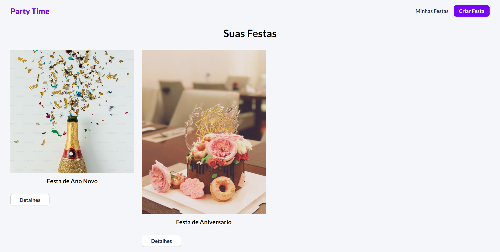

# Ignite Festas

Aplicação full-stack, criada utilizando o MongoDB na parte de Back-end e no front-end utilizando o framework React.

Um site para você fazer o orçamento da sua festa, só vem que tem muito mas.

Para você ter acesso ao Back-end  você pode esta baixando o código e no seu VScode você pode abrir a pasta backend e rodar o comando "npm run start".

Na parte do Front-end abrindo o terminal você pode rodar o comando "npm run dev"